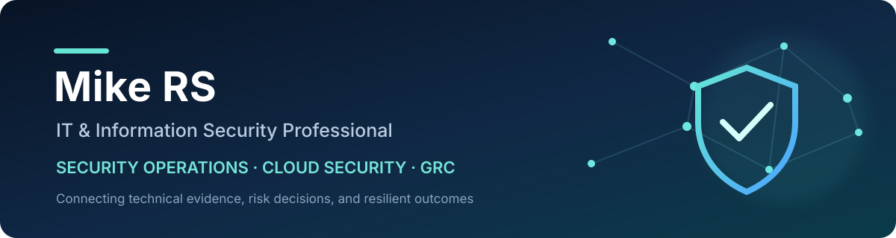

  

# Hi, I'm Michael Solomon

I am an IT and information security professional with 12+ years of experience across enterprise, hybrid-cloud, on-premises, and managed security environments.

My work sits at the intersection of **security operations**, **security engineering**, and **governance, risk, and compliance (GRC)**. I turn technical findings into clear risk decisions, practical remediation, measurable controls, and useful reporting for both engineering teams and leadership.

## Where I add value

- Lead security programs across cloud, network, endpoint, identity, Microsoft 365, and hybrid environments.
- Coordinate incident investigation, vulnerability remediation, risk treatment, and stakeholder communication.
- Strengthen audit readiness and control effectiveness across ISO/IEC 27001, NIST CSF, CIS Controls, PCI DSS, SOC 1, and SOC 2.
- Govern managed security services, vendors, service levels, and third-party security outcomes.
- Build cyber-risk dashboards that connect operational evidence with executive decisions.

## Security domains

**Operations and response**

Incident response · Threat coordination · Vulnerability management · Penetration-test remediation · SIEM/XDR/SOAR · MSSP/MSOC oversight

**Engineering and architecture**

AWS · GCP · Azure · Microsoft security ecosystem · IAM/PAM · Conditional Access · DLP · Zero Trust · Endpoint, network, and cloud security · Firewalls · IPS/WAF · Secure hardening

**Governance, risk, and compliance**

Security strategy · Risk assessment · Policy management · Audit readiness · Control effectiveness · Third-party risk · Vendor and SLA governance · Executive reporting

## Credentials

- ISO/IEC 27001:2022 Lead Auditor
- NIST Cybersecurity Framework 2.0 Lead Implementer
- Certified in Cybersecurity (ISC2)
- Certified Professional Ethical Hacker (Mile2)
- MBA, Major in Cybersecurity (2024)
- BS Information Technology (2010)

## Career snapshot

| Period | Organization | Role |
| --- | --- | --- |
| 2021-2026 | NQX | IT Security Lead |
| 2016-2020 | DXC Technology | IT Security Officer - ANZ and European clients |
| 2016 | OpenText | Information Security Engineer |
| 2014-2016 | SMITS Incorporated | IT Security Specialist |
| 2011-2013 | IBM Global Process Services | IT Support Engineer |

## What I am building here

I am developing this profile into a practical security knowledge base. Planned public work includes:

- **Security governance toolkit** - reusable examples for risk registers, control evidence, audit preparation, and executive reporting.
- **Cloud security control baselines** - vendor-neutral guidance for AWS, Azure, GCP, identity, endpoint, and data protection.
- **Incident response playbooks** - practical, tabletop-friendly response flows and post-incident improvement templates.
- **Cyber-risk dashboard examples** - synthetic-data demonstrations that translate operational metrics into leadership decisions.

All examples will use synthetic or sanitized data and will not disclose employer, client, or incident-sensitive information.

## Professional interests

Cloud and hybrid security · Security operations maturity · Risk-based control design · Zero Trust · IAM/PAM · Security metrics · Audit-ready engineering · Practical uses of automation in cyber risk

## Connect

I welcome thoughtful conversations about security leadership, cloud controls, operational resilience, GRC, and opportunities to make security programs more measurable and effective. Use the contact links in my GitHub profile sidebar.
